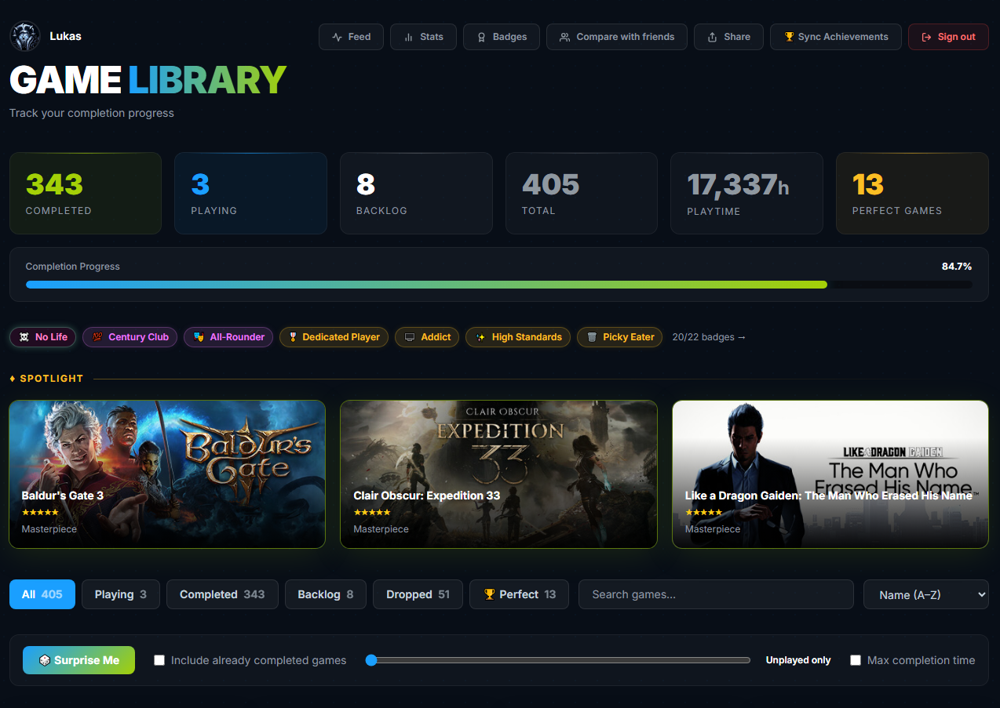
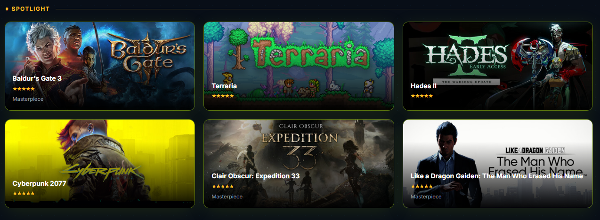
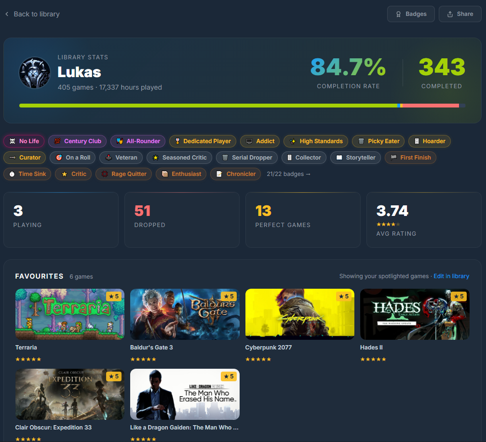
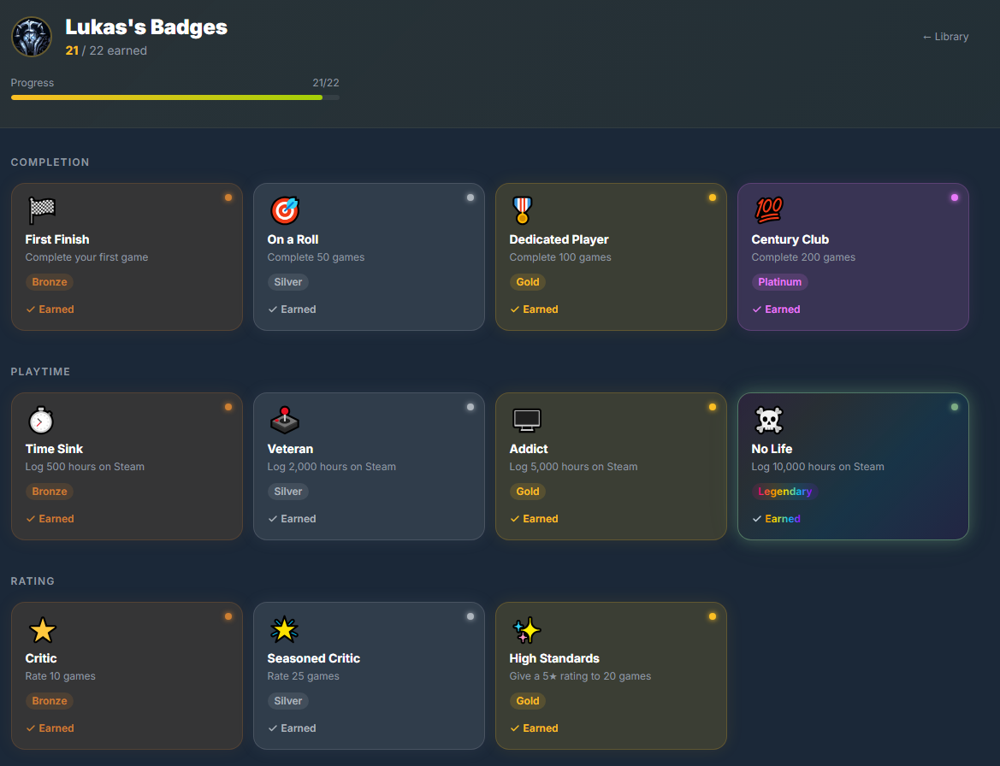
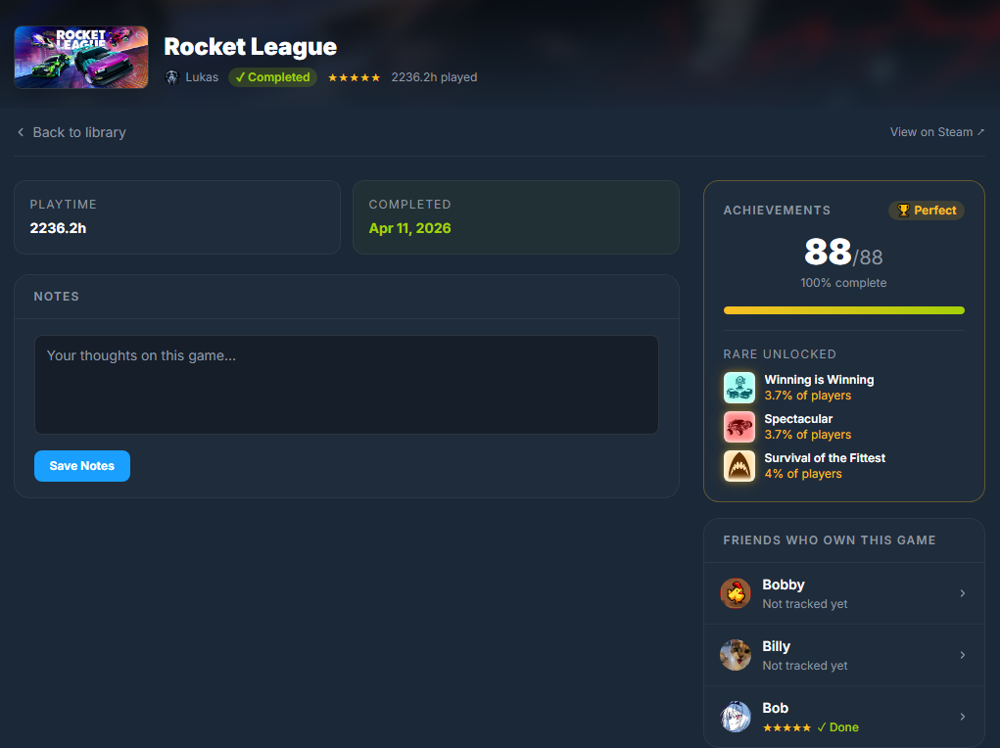
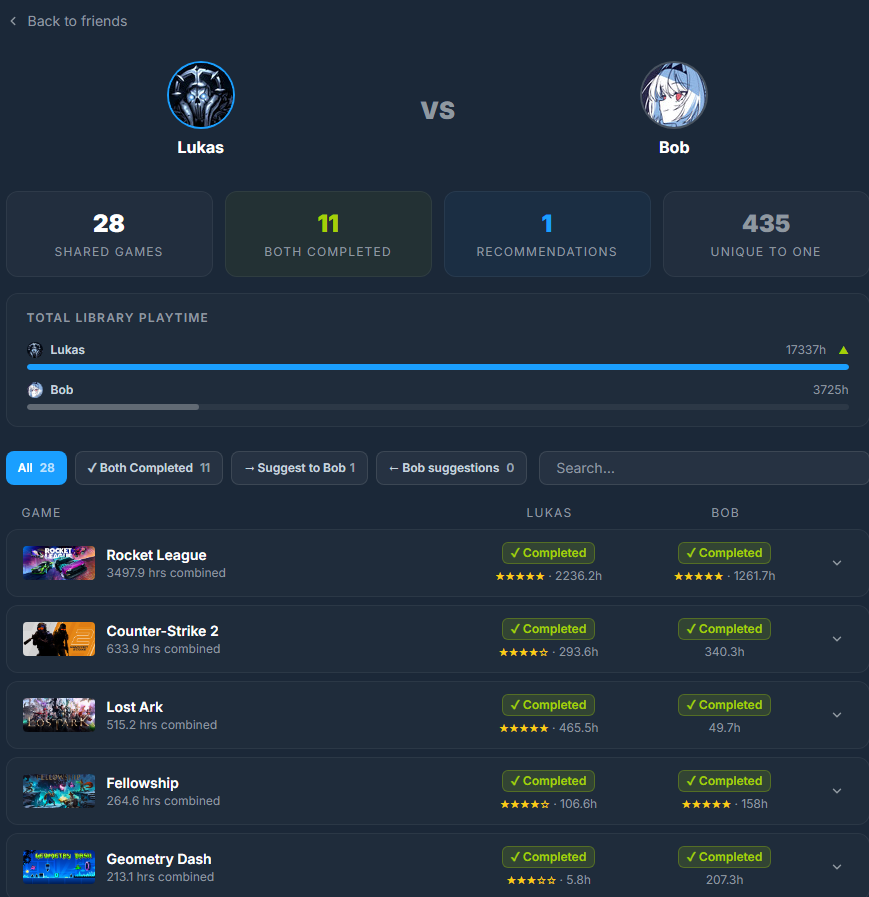

# Steam Game Tracker

Track your Steam library the way you actually want to. Mark games as playing, completed, or dropped. Rate them, add notes, earn badges, and compare your progress with friends.

**Live at [steamgametracker.com](https://steamgametracker.com)**

---



## Features

**Library** - Your full Steam library with status tracking (Playing / Completed / Dropped), star ratings, personal notes, and a live "now playing" indicator.

**Spotlight** - Pin your favourite games to the top of your library via drag and drop.

**Game Detail** - Deep dive into any game: playtime, HLTB completion time, achievement tracking with rare achievement highlights, and a friends section showing who else owns it.

**Badges** - 19 badges across 6 categories (Completion, Playtime, Rating, Dropped, Library, Special) with 5 tiers up to Legendary.

**Stats** - A full breakdown of your library: completion rate, most played, backlog hours, rating distribution, and more.

**Compare** - Side-by-side library comparison with any Steam friend, including badge comparison.

**Activity Feed** - A global feed of recent completions, drops, and rating changes across all users.

**Friend Invites** - Invite friends via a secret link so they can track their own library too.

---

## Screenshots

| Library | Spotlight |
|---------|-----------|
|  |  |

| Stats | Badges |
|-------|--------|
|  |  |

| Game Detail | Compare |
|-------------|---------|
|  |  |

---

## Stack

- **Symfony 8 / PHP 8.4** - backend framework
- **Doctrine ORM + MySQL 8** - database
- **Twig** - templating
- **Tailwind CSS (Play CDN) + Vanilla JS** - frontend, no build pipeline
- **Guzzle** - Steam API HTTP client
- **Docker Compose** - nginx + php-fpm + mysql

---

## Local Development

**Requirements:** Docker Desktop

```bash
git clone https://github.com/lukasstock/steamtracker.git
cd steamtracker
cp .env.example .env   # fill in your values
docker compose up -d
docker compose exec php composer install
docker compose exec php bin/console doctrine:migrations:migrate --no-interaction
```

App runs at `http://localhost:8000`.

### Environment Variables

See `.env.example` for all required variables. You'll need:

- A [Steam Web API key](https://steamcommunity.com/dev/apikey)
- Your 17-digit Steam ID
- A MySQL password of your choice

---

## Deployment

Deployed via GitHub Actions on push to `master`. The workflow SSHes into the server, pulls the latest code, rebuilds Docker containers, and runs migrations automatically.
